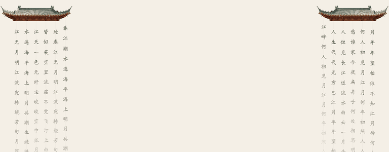

# 屋檐挂件（eave-curtain）



一个**零依赖、自包含**的网页装饰脚本：页面顶部左右两侧各有一片古风屋檐，屋檐下挂着随风摆动的文字链条。移动鼠标靠近，文字链条会像珠帘一样被拨开。

> 预览效果：用浏览器打开本目录下的 `demo.html`（推荐走本地服务器，见下文），即可看到春夏秋冬四种屋檐和文字链条的切换效果。

---

## 一、快速开始（一行引入）

把 `eave-curtain.js` 和 `images/` 文件夹放到你的网站任意目录下，然后在页面 `</body>` 前加一行：

```html
<script src="eave-curtain.js" defer></script>
```

> ⚠️ 注意：`eave-curtain.js` 和 `images/` 的相对位置不要变（默认图片路径是 `images/`）。如果你把图片放到了别的目录或 CDN，请看下文「三、配置」。

---

## 二、运行机制（这个挂件是怎么工作的）

### 1. 自动切换季节主题
内置 4 个主题：**春 / 夏 / 秋 / 冬**，每个主题 = 一张屋檐图 + 左右两串文字。

- 每 **15 秒**自动切换到下一季，循环往复（可在 `CONFIG.switchInterval` 修改）。
- 切换时脚本会重新扫描新屋檐图的边缘，把文字重新挂到正确位置。

### 2. 文字链条
- 文字用 Canvas 逐字画成一条条**挂在屋檐下的链条**（不是 HTML 文本）。
- 从屋檐下缘开始，字间距 30px，每条约 14~22 个字。
- 越往下透明度越低（渐隐效果）。
- 文字颜色随页面深浅色模式自动切换：深色下为暖米色 `#e3d3b6`，浅色下为深灰 `#2e2b2a`。

### 3. 鼠标交互
- 每个字都是一个物理粒子：受**重力**下落，相邻字被“绳子”拉紧，整体像真的珠帘。
- 鼠标靠近（默认半径 90px）会产生**推力**，文字链条被拨开，移走后回摆。
- 挂件开启了 `pointer-events: none`，**鼠标点击可穿透**，不会挡住你页面上的按钮和链接。

### 4. 响应式
- 默认在屏幕宽度 ≤ 900px 时自动隐藏，避免干扰手机阅读（可在 `CONFIG.hideOnMobile` 关闭）。

---

## 三、配置（改 `eave-curtain.js` 顶部的 `CONFIG`）

```js
const CONFIG = {
    imgBase: "images/",          // 图片目录，结尾带 /，可填 CDN 绝对地址
    switchInterval: 15000,       // 季节切换间隔（毫秒）
    mouseInteraction: true,      // 是否开启鼠标互动
    mouseRadius: 90,             // 鼠标推力半径（像素）
    gravity: 0.28,               // 重力大小
    spacing: 30,                 // 相邻字间距（像素）
    roofWidth: 240,              // 屋檐显示宽度（像素）
    hideOnMobile: true,          // 窄屏是否隐藏
    mobileMaxWidth: 900,         // 窄屏阈值（像素）
};
```

---

## 四、自定义图片和文字（重要）

### 改图片

`images/` 下的 4 张图是**初始示例图**，你可以换成任何你喜欢的图案（动漫屋檐、古风楼阁、圣诞彩带、自定义徽章……）。

- **格式**：必须是**带透明通道的 PNG**（不能是 JPG）。脚本靠扫描图片的 alpha（不透明）通道来判断屋檐下边缘。
- **构图**：图案请放在图片的**上半部分**，**下半部分保持透明**——文字链条会挂在“不透明区域的最下边缘”。
- **尺寸**：原始示例图为 862×289。宽度任意，建议比例接近即可（显示时会统一缩放到 240px 宽）。
- **替换方法**：
  1. 直接用同名文件覆盖 `images/` 里的图片；
  2. 或换一张新图后，改 `THEMES` 中对应主题的 `img` 字段指向它。

### 改文字

挂在屋檐下的文字就是 `THEMES` 数组里的 `leftText` 和 `rightText`：

```js
const THEMES = [
    {
        season: "Spring",
        img: "eave_spring.png",
        leftText: "这里改成你想要的左侧文字",
        rightText: "这里改成你想要的右侧文字"
    },
    // ...
];
```

- 文字会被**逐字拆开**挂到链条上，所以写什么内容都可以，不一定是古诗。
- 想增删季节主题？直接增删 `THEMES` 数组里的对象即可（挂件会自动按数组顺序循环切换）。

---

## 五、本地预览与调试

### 为什么建议用本地服务器？
直接双击 `demo.html`（`file://` 协议）时，浏览器出于安全限制会**禁止读取本地图片像素**（Canvas 污染），此时脚本会自动**降级**：文字仍能摆动，但统一挂在图片底部、不再贴合屋檐边缘。

想看到完整效果，请在本目录起一个本地服务器：

```bash
# Python 3
python3 -m http.server 8000

# 或 Node.js（需先安装 http-server）
npx http-server -p 8000
```

然后浏览器打开：`http://localhost:8000/demo.html`

---

## 六、目录结构

```
eave-curtain/
├── eave-curtain.js      # 自包含脚本（样式 + DOM + 物理引擎都在里面）
├── images/              # 4 张初始屋檐图，可替换
│   ├── eave_spring.png
│   ├── eave_summer.png
│   ├── eave_autumn.png
│   └── eave_winter.png
├── demo.html            # 演示页面
└── README.md            # 本说明
```

---

## 七、常见问题

**Q：挂了挂件后页面出现滚动条 / 内容被挡住？**
挂件容器是 `position: absolute` 且 `pointer-events: none`，不会撑开页面、也不会挡点击。如果正文顶部被屋檐视觉遮挡，可给你的内容容器加一点顶部 padding。

**Q：文字没有贴合屋檐边缘？**
多半是 `file://` 直接打开导致的降级。改走本地服务器即可。

**Q：想换成自己的中文字体？**
编辑脚本里的 `ctx.font` 字符串（在 `tick` 函数内），把字体名换成你想要的，注意字体系列用引号包裹、多个字体用逗号分隔作为兜底。
